# ADR-0005: Admin Panel Plugin Architecture

**Date**: 2026-02-24
**Status**: Accepted
**Deciders**: AWSUGCBBA Platform Team

## Context

The platform has 5 independently deployed microservices. Each service has its own admin surface
(user management, config, RBAC, dashboards). We need a unified admin UI so operators don't have
to navigate 5 separate interfaces.

### Constraints

- Single small team — not multiple teams shipping independently
- Phase 4 work — admin panel is the last service to be built
- Security is non-negotiable — admin panel has elevated privileges
- Services are independently deployed Lambdas behind API Gateway
- All services already validate RS256 JWTs via `ugsys-auth-client`

### What the admin panel must do

- Provide a single login and unified nav for all services
- Let each service own its full admin UI (not just generic CRUD forms)
- Allow new services to plug in without changing the panel's code
- Keep auth and RBAC centralized in identity-manager
- Let operators configure service-specific parameters per service

---

## Decision

### 1. Frontend architecture — React SPA with Plugin Manifest system

**Decision**: The admin panel is a single React + Vite SPA (Admin Shell) that dynamically
loads micro-frontend bundles contributed by registered services. Each service exposes a
Plugin Manifest at a well-known URL describing its JS bundle, navigation entries, routes,
required roles, and config schema. The Admin Shell fetches manifests from the BFF and mounts
the appropriate bundle when the user navigates to a service's section.

**Why not a pure monorepo FSD approach**: The plugin manifest system allows services to ship
their own admin UI independently without requiring a rebuild of the Admin Shell. Each service
team controls its own frontend release cadence.

**Why not Module Federation**: MFEs are worth the complexity when the bottleneck is
organizational scale (many independent teams). We have one team. The costs are real:

- Remote entry waterfall: N services × N network hops before first render
- Version skew: compatibility matrix grows as O(N²) across service versions
- Build complexity: each service needs a federation-aware build pipeline
- XSS surface: passing JWT as a prop to dynamically loaded remote code is a security risk

The Plugin Manifest approach gives us dynamic service discovery without the MFE build
complexity. The Admin Shell loads bundles at runtime via dynamic `import()`.

### 2. Service registration — hybrid seed + runtime API

Known platform services are pre-seeded from a static configuration file (`config/seed_services.json`)
loaded at BFF startup. This avoids requiring every service to self-register on every cold start.

- **Seed entries**: loaded from `config/seed_services.json` at BFF startup via `seed_loader.py`.
  Marked `registration_source: "seed"`. Cannot be deleted without `force=true`.
- **Runtime entries**: registered via `POST /api/v1/registry/services` with a valid S2S JWT
  or by a `super_admin`. Marked `registration_source: "api"`.
- **Environment overrides**: `SEED_<SERVICE_NAME>_BASE_URL` env vars override seed base URLs
  per environment without changing the seed file.

This is a deliberate departure from the original "push at startup" design. Services do not
need to call the admin panel at startup — the admin panel knows about them via the seed file.

### 3. Auth — HttpOnly cookie, never JS-accessible token

**Decision**: The admin panel authenticates via identity-manager. The JWT is stored in an
`httpOnly`, `Secure`, `SameSite=Lax` cookie — never in localStorage, sessionStorage, or a
React prop/context.

**Why**: Any XSS vulnerability (including in a dynamically loaded micro-frontend bundle) can
exfiltrate a JS-accessible token. HttpOnly cookies are inaccessible to JavaScript by design.

For cross-origin requests to service APIs (different subdomains), the panel uses the BFF proxy:

```mermaid
sequenceDiagram
    participant SPA as Admin Shell
    participant BFF as Admin Panel BFF
    participant SVC as Target Service

    SPA->>BFF: POST /api/v1/proxy/{service}/{path}<br/>Cookie: access_token=&lt;JWT&gt; (httpOnly)
    BFF->>BFF: Validate JWT (RS256)<br/>Check RBAC roles
    BFF->>SVC: Forward request<br/>Authorization: Bearer &lt;JWT&gt;<br/>X-Request-ID: &lt;correlation-id&gt;
    SVC-->>BFF: Response
    BFF-->>SPA: Forward response
```

### 4. Service config — stored in BFF Service Registry, served via config-schema endpoint

Each service's Plugin Manifest includes an optional `configSchema` (JSON Schema). The BFF
stores this schema in the Service Registry DynamoDB table and exposes it via
`GET /api/v1/registry/services/{service_name}/config-schema`. The Admin Shell renders a
dynamic form from the schema. Config changes are submitted via
`POST /api/v1/proxy/{service_name}/config` and validated against the schema before forwarding.

### 5. RBAC — JWT claims enforced at BFF layer

Roles are carried in the JWT `roles` claim (issued by identity-manager). The BFF validates
roles on every request. The Admin Shell hides navigation entries and disables UI actions
based on the same role data via a shared RBAC context provider.

Only users with `super_admin`, `admin`, `moderator`, or `auditor` roles can access the panel.
`member`, `guest`, and `system` roles receive HTTP 403.

---

## Architecture Flow

```mermaid
flowchart TD
    subgraph Startup["BFF Startup"]
        SEED["seed_loader.py\nreads seed_services.json"]
        SEED -->|upsert| REG[("Service Registry\nDynamoDB")]
    end

    subgraph Login["Admin Login"]
        A["Browser → POST /api/v1/auth/login"] --> B["BFF forwards to identity-manager"]
        B --> C["BFF sets httpOnly cookie\naccess_token + refresh_token"]
        C --> D["Browser → GET /api/v1/registry/services"]
        D --> E["Admin Shell renders nav\nfrom Plugin Manifests"]
    end

    subgraph ProxyFlow["Admin Action"]
        F["Admin Shell → POST /api/v1/proxy/{service}/{path}"] --> G["BFF validates JWT + RBAC"]
        G --> H["BFF forwards to target service\nAuthorization: Bearer JWT"]
        H --> I["Target service validates JWT\nvia ugsys-auth-client"]
    end
```



## BFF API Surface

| Method | Path | Auth | Description |
|--------|------|------|-------------|
| POST | `/api/v1/auth/login` | None | Authenticate, set httpOnly cookies |
| POST | `/api/v1/auth/logout` | Cookie | Clear cookies, call identity-manager logout |
| POST | `/api/v1/auth/refresh` | Cookie | Transparent token refresh |
| GET | `/api/v1/auth/me` | Cookie | Current user info (JWT + profile enrichment) |
| POST | `/api/v1/registry/services` | S2S or super_admin | Register/update service |
| GET | `/api/v1/registry/services` | admin+ | List services (role-filtered) |
| DELETE | `/api/v1/registry/services/{name}` | super_admin | Deregister service |
| GET | `/api/v1/registry/services/{name}/config-schema` | admin+ | Get config JSON Schema |
| ANY | `/api/v1/proxy/{service}/{path}` | admin+ | Forward to downstream service |
| GET | `/api/v1/health/services` | admin+ | Aggregated health status |
| GET | `/api/v1/users` | admin+ | Paginated user list (enriched) |
| PATCH | `/api/v1/users/{id}/roles` | super_admin | Change user roles |
| PATCH | `/api/v1/users/{id}/status` | admin+ | Activate/deactivate user |
| GET | `/api/v1/audit/logs` | auditor+ | Paginated audit log |
| GET | `/health` | None | BFF own health check |
| POST | `/internal/events` | Infra-level | Receive EventBridge events |

---

## Consequences

**Positive**:

- No XSS token exfiltration risk — JWT never in JS memory
- No remote entry waterfall — Plugin Manifest fetched once, bundle loaded on demand
- No version skew problem — each service ships its own bundle independently
- Adding a new service = add to seed file + expose Plugin Manifest endpoint
- BFF proxy is a natural place to add audit logging for all admin actions
- Hybrid seed approach means no service needs to call the admin panel at startup

**Negative / accepted trade-offs**:

- BFF proxy adds one network hop for cross-service admin calls
  (mitigated: admin panel is low-traffic, latency is acceptable)
- HttpOnly cookie requires CSRF protection (mitigated: Double Submit Cookie pattern)
- Micro-frontend bundles loaded from service origins require CSP configuration

---

## Alternatives Considered

- **Module Federation (micro-frontends)**: Rejected. Complexity cost exceeds benefit for a
  single team. Revisit if team grows to 3+ independent squads.
- **JWT as React prop / context**: Rejected — XSS risk.
- **localStorage for JWT**: Rejected — industry consensus is clear: XSS = game over.
- **Push-at-startup registration**: Rejected in favour of hybrid seed approach. Services
  should not need to know the admin panel's URL, and cold starts should not depend on
  cross-service registration calls succeeding.
- **Generic form rendering only (no custom UI per service)**: Available as per-service
  fallback for simple services via the configSchema form renderer.

---

## References

- `specs/platform-contract.md` Section 14 — Admin Panel Plugin Contract
- ADR-0001 — Microservices Architecture
- ADR-0006 — Lambda Container Image Packaging
- [Micro-Frontends: Are They Still Worth It in 2025?](https://feature-sliced.design/blog/micro-frontend-architecture)
- [Stop Storing JWT in LocalStorage: HttpOnly Cookie Strategy](https://openillumi.com/en/en-react-rest-jwt-httponly-security/)
